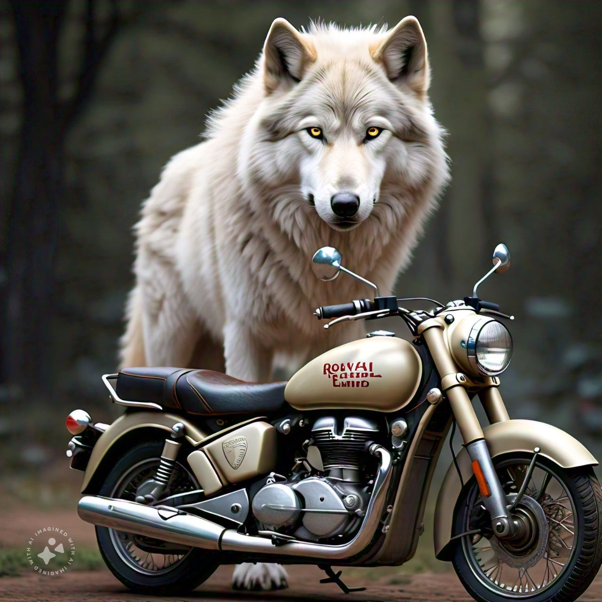
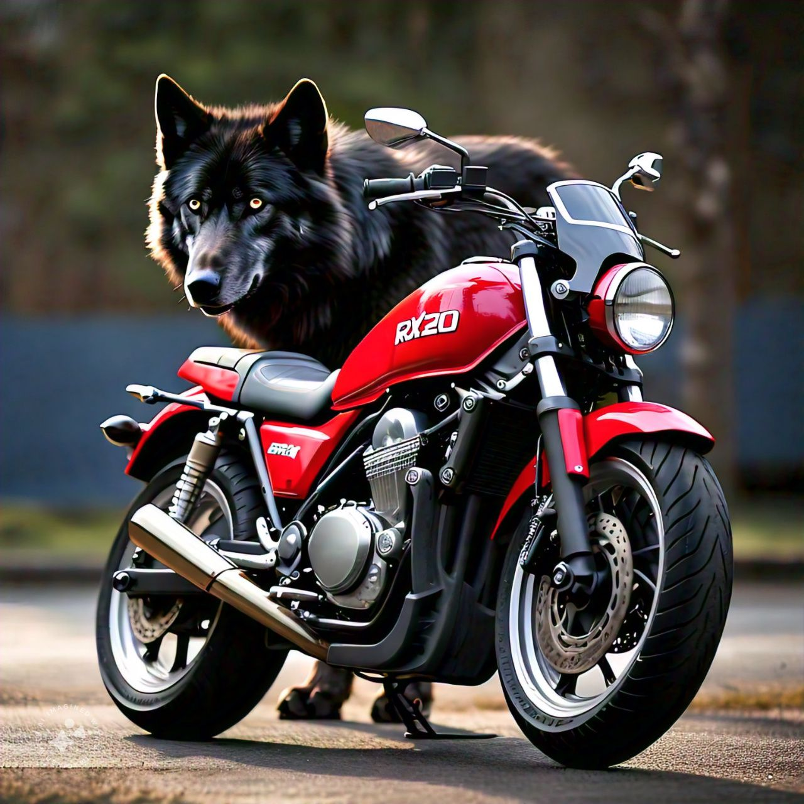
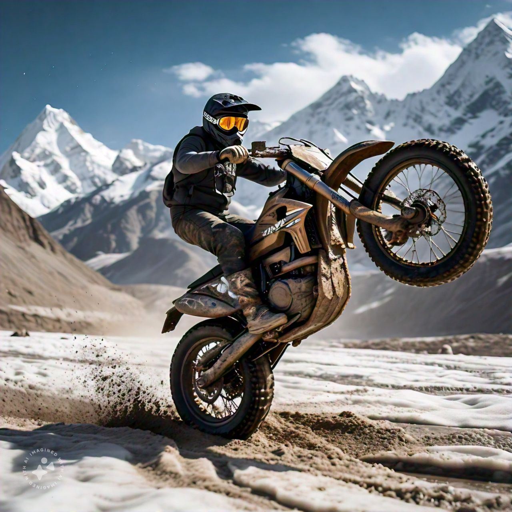

# H4HARIT
 
 
 
 
 
 
 

 
 
 
 
 
 

 
 
 
 
 
 

 
 
 
 
 
 

 
 
 
 
 
 

 
 
 
 
 
 

 
 
 
 
 
 

 
 
 
 
 
 

 
 
 
 
 
 

 
 
 

 
 
 
 

 
 
 
 
 
 

 
 
 
 
 
 

 

 
 
 
 
 
 

 
 
 
 
 
 

 
 
 
 
 
 

 
 
 
 
 
 
 

 
 
 
 
 
 

 
 
 
 
 
 

 
 
 
 
 
 
 

 
 
 
 
 
 

 
 
 
 
 
 

 
 
 
 
 
 

